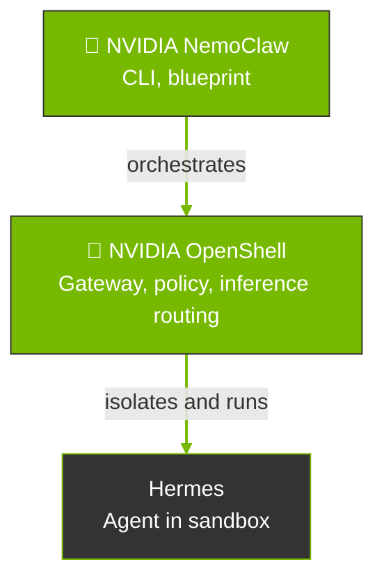

NemoClaw provides onboarding, lifecycle management, and Hermes operations within OpenShell containers.
Use the `nemohermes` CLI alias when you work from the Hermes agent guide; it is equivalent to `nemoclaw` with the Hermes agent pre-selected.

This page describes how these projects form the ecosystem, where NemoClaw sits relative to [OpenShell](https://github.com/NVIDIA/OpenShell) and [Hermes](https://hermes-agent.nousresearch.com/docs/), and how to choose between NemoHermes and OpenShell alone.

## How the Stack Fits Together

A NemoClaw for Hermes deployment combines three pieces with distinct scopes: Hermes, OpenShell, and NemoClaw.
The following diagram shows how they fit together.

NemoClaw sits above OpenShell in the operator workflow.
It drives OpenShell APIs and CLI to create and configure the sandbox that runs Hermes.
Models and endpoints sit behind OpenShell's inference routing.
NemoClaw onboarding wires provider choice into that routing, including the Hermes Provider route when you onboard through `nemohermes`.

The following table shows the scope of each component in the stack.

| Project | Scope |
|---------|--------|
| [Hermes](https://hermes-agent.nousresearch.com/docs/) | The agent: runtime, tools, messaging adapters, and an OpenAI-compatible API inside the container. It does not define the sandbox or the host gateway. |
| [OpenShell](https://github.com/NVIDIA/OpenShell) | The execution environment: sandbox lifecycle, network, filesystem, and process policy, inference routing, and the operator-facing `openshell` CLI for those primitives. |
| NemoClaw | The NVIDIA reference stack on the host: `nemohermes` / `nemoclaw` CLI, versioned blueprint, channel messaging configured for OpenShell-managed delivery, and state migration helpers so Hermes runs inside OpenShell in a documented, repeatable way. |

## NemoClaw Path versus OpenShell Path

Both paths assume OpenShell can sandbox a workload.
The difference is who owns the integration work.

| Path | What it means |
|------|---------------|
| **NemoClaw path** | You adopt the reference stack. NemoClaw's Hermes blueprint encodes a hardened image, default policies, and orchestration so `nemohermes onboard` can create a known-good Hermes-on-OpenShell setup with less custom glue. |
| **OpenShell path** | You use OpenShell as the platform and supply your own container, Hermes install steps, policy YAML, provider setup, and any host bridges. OpenShell stays the sandbox and policy engine; nothing requires NemoClaw's blueprint or CLI. |

## What NemoClaw Adds Beyond Custom OpenShell

You can run Hermes inside OpenShell without NemoClaw by building your own image, writing policy YAML, registering providers, and wiring inference routes yourself.
That path is valid when you need full control over the container layout.

NemoClaw builds on OpenShell with additional security hardening, automation, and lifecycle tooling for Hermes.
The following table compares custom OpenShell integration with `nemohermes onboard`.

| Capability | Custom OpenShell + Hermes | `nemohermes onboard` |
|---|---|---|
| Sandbox isolation | Yes, when you apply OpenShell seccomp, Landlock, network namespace isolation, and no-new-privileges enforcement through your policy. | Yes. NemoClaw applies these through the blueprint and layers a Hermes-specific restrictive policy on top. |
| Credential handling | You create OpenShell providers manually with `openshell provider create` and configure placeholder resolution at egress. | NemoClaw creates OpenShell providers during onboarding and filters sensitive host environment variables from the sandbox creation command to reduce accidental leakage through build args. |
| Image hardening | Depends on your base image and install steps. | NemoClaw strips build toolchains (`gcc`, `g++`, `make`) and network probes (`netcat`) from the runtime image to reduce attack surface. |
| Filesystem policy | You define read-only and read-write paths in policy YAML. | NemoClaw defines a targeted layout: system paths (`/usr`, `/lib`, `/etc`) are read-only; `/sandbox` and `/sandbox/.hermes` are writable for agent state and configuration. |
| Inference setup | You configure OpenShell inference routing and Hermes `config.yaml` manually. | NemoClaw validates credentials from the host, configures the OpenShell route, and bakes model settings into `/sandbox/.hermes/config.yaml`. Hermes Provider onboarding is available through `nemohermes`. |
| Channel messaging | OpenShell delivers channel tokens through its provider system and L7 proxy; you configure Hermes platform adapters manually. | NemoClaw automates supported channel setup during onboarding and bakes Hermes env/config with placeholder tokens that OpenShell resolves at egress. |
| Blueprint versioning | No NemoClaw blueprint; your image tag is whatever you built locally. | NemoClaw downloads the blueprint artifact, checks version compatibility, and verifies its digest before applying. Running `nemohermes onboard` on different machines produces the same sandbox. |
| State migration | Not included unless you build it. | NemoClaw migrates agent state across machines with credential stripping and integrity verification. |
| Process count limits | You set process count limits manually with `--ulimit` or orchestrator config. | NemoClaw applies `ulimit -u 512` in the container entrypoint on top of OpenShell's seccomp and privilege dropping. |

## When to Use Which

Use the following table to decide when to use NemoHermes versus OpenShell alone.

| Situation | Prefer |
|-----------|--------|
| You want Hermes with minimal assembly, NVIDIA defaults, and the documented install and onboard flow. | NemoClaw (`nemohermes`) |
| You need maximum flexibility for custom images, a layout that does not match the NemoClaw Hermes blueprint, or a workload outside this reference stack. | OpenShell with your own integration |
| You are standardizing on the NVIDIA reference for always-on Hermes agents with policy and inference routing. | NemoClaw (`nemohermes`) |
| You are building internal platform abstractions where the NemoClaw CLI or blueprint is not the right fit. | OpenShell (and your orchestration) |

## Related Topics

- [Overview](overview) describes what NemoClaw is, including capabilities, benefits, and use cases.
- [How It Works](how-it-works) describes how NemoClaw runs, the blueprint, sandbox creation, routing, and protection layers for Hermes.
- [Architecture](../reference/architecture) shows the repository structure and technical diagrams.
- [Quickstart with Hermes](../get-started/quickstart) installs NemoClaw and launches your first Hermes sandbox.
